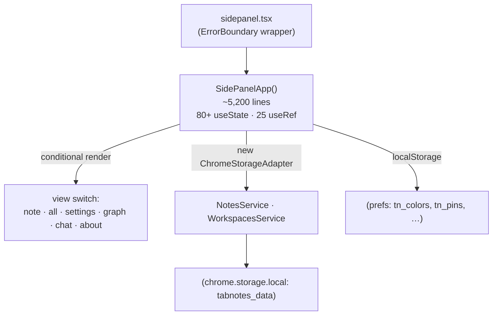
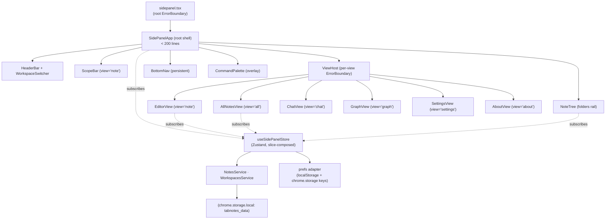

# Design Document

## Overview

This design decomposes `apps/extension/src/sidepanel/SidePanelApp.tsx` (~5,200 lines, 80+
`useState`, ~25 `useRef`) into a set of cohesive Feature_Modules coordinated through a single
Zustand store organized into per-concern slices. The work is internal: there is **zero
user-visible behavior or visual change**. The deprecated `document.execCommand` editor mechanics
are explicitly preserved as-is (their replacement is a separate future spec).

The design is built around three pillars:

1. **A single Zustand store, slice-composed.** One store keeps cross-tab sync, autosave
   coordination, and view state coherent in one place, while slice creators keep each concern's
   state and actions cohesive and independently testable.
2. **Feature_Modules that read/write the store via typed selectors and actions.** Modules stop
   threading dozens of props; they subscribe to exactly the slices they need.
3. **Incremental, build-green slices.** Store scaffolding lands first behind a bridge, then
   leaf modules are extracted before the high-risk Editor, so the Monolith shrinks gradually and
   every increment passes lint/typecheck/test/build.

The design satisfies all 10 requirements; each major section ends with a traceability note.

### Goals

- Decompose the Monolith into 8 Feature_Modules + a thin root, none exceeding 1,000 lines.
- Replace the flat hook surface with a Zustand store of typed slices.
- Preserve every behavior in Requirement 3 and every visual in Requirement 4 exactly.
- Keep persistence on the existing Storage_Layer; no schema change; `STORAGE_VERSION` stays 3.
- Move pure logic to `@tabnotes/shared` with unit tests; keep the shared suite ≥ 47 tests.
- Add a Playwright Browser_Verification harness against the unpacked extension.

### Non-Goals

- Replacing `document.execCommand` or migrating to a rich-text framework (future spec).
- Changing the storage schema, data model, or `chrome.storage` keys.
- Any new feature, view, icon, or visual treatment.
- Refactoring the companion web app (`apps/web`) or `packages/ui` beyond what's shared.

## Architecture

### Current state (before)



### Target state (after)



The root component owns no domain state. It composes persistent chrome (header, scope bar,
folder tree, bottom nav) plus a `ViewHost` that mounts exactly one view module based on
`store.view`. Overlays (command palette, reference panel) render at the root level as today.

_Traceability: R1.1–R1.5 (module set, single root, per-file location, ≤1,000 lines, same views),
R10 (error isolation via ViewHost boundaries)._

### Directory layout

```
apps/extension/src/sidepanel/
  sidepanel.tsx                  # entry (unchanged: root ErrorBoundary + <SidePanelApp/>)
  SidePanelApp.tsx               # NEW thin root shell (<200 lines)
  store/
    index.ts                     # createStore + slice composition; exports useSidePanelStore
    types.ts                     # SidePanelState, slice interfaces
    editorSlice.ts
    noteListSlice.ts             # notes, folders, tree, drag/drop, bulk-select
    commandPaletteSlice.ts
    chatSlice.ts
    settingsSlice.ts             # theme, features, fontSize, align, digest, backup, prefs
    contextSlice.ts              # tab url/domain, scope, workspace, view, sync coordination
    runtime.ts                   # non-reactive refs registry (timers, editor DOM node)
  components/
    HeaderBar.tsx
    WorkspaceSwitcher.tsx
    ScopeBar.tsx
    NoteTree.tsx                 # folder rail + drag/drop
    NotePills.tsx                # context note picker
    BottomNav.tsx
    CommandPalette.tsx
    ReferencePanel.tsx
  views/
    EditorView.tsx               # contentEditable editor + formatting toolbar (execCommand preserved)
    AllNotesView.tsx
    ChatView.tsx
    GraphView.tsx                # wraps existing NoteGraph
    SettingsView.tsx
    AboutView.tsx
  editor/
    NoteGraph.tsx                # moved out of the monolith (pure-ish SVG component)
    checklist.ts                 # checklist parse/serialize helpers (thin wrapper over shared)
  styles/                        # CSS split to match modules (see CSS strategy)
    *.css
```

`@tabnotes/shared` gains pure logic (see §Pure-logic extraction).

## Components and Interfaces

### Root shell — `SidePanelApp.tsx`

Responsibilities: mount the store provider-free hook (`useSidePanelStore`), run top-level effects
that must exist once (storage `onChanged` listener, online/offline, quick-capture, initial load),
and compose chrome + `ViewHost`. It holds **no** `useState` for domain data; only the editor DOM
ref is created here and registered into the runtime registry (see below).

```tsx
export default function SidePanelApp() {
  useBootstrap();            // initial load + tab context + prefs (effect hook)
  useCrossTabSync();         // chrome.storage.onChanged wiring (effect hook)
  const view = useSidePanelStore((s) => s.view);
  return (
    <div className="sp-root">
      <HeaderBar />
      {view === 'note' && <ScopeBar />}
      <div className="sp-main">
        <NoteTree />
        <ViewHost view={view} />
      </div>
      <BottomNav />
      <CommandPalette />
    </div>
  );
}
```

`ViewHost` maps `view` → module and wraps each in an `ErrorBoundary`:

```tsx
function ViewHost({ view }: { view: View }) {
  return (
    <div className="sp-content">
      <ErrorBoundary label={`${view} view`}>
        {view === 'note' && <EditorView />}
        {view === 'all' && <AllNotesView />}
        {view === 'chat' && <ChatView />}
        {view === 'graph' && <GraphView />}
        {view === 'settings' && <SettingsView />}
        {view === 'about' && <AboutView />}
      </ErrorBoundary>
    </div>
  );
}
```

_Traceability: R1.2, R1.5, R10.1–R10.3._

### The store — `useSidePanelStore`

A single Zustand store created with the slice pattern, consistent with `apps/web`'s use of
`create()` from `zustand` v5. Slices are created by slice-creator functions and merged:

```ts
// store/index.ts
import { create } from 'zustand';
import { createContextSlice } from './contextSlice';
import { createEditorSlice } from './editorSlice';
import { createNoteListSlice } from './noteListSlice';
import { createCommandPaletteSlice } from './commandPaletteSlice';
import { createChatSlice } from './chatSlice';
import { createSettingsSlice } from './settingsSlice';
import type { SidePanelState } from './types';

export const useSidePanelStore = create<SidePanelState>()((...a) => ({
  ...createContextSlice(...a),
  ...createEditorSlice(...a),
  ...createNoteListSlice(...a),
  ...createCommandPaletteSlice(...a),
  ...createChatSlice(...a),
  ...createSettingsSlice(...a),
}));
```

Each slice creator has the standard Zustand signature `(set, get, store) => SliceShape`. Slices
**do not** reach into another slice's fields via untyped access; cross-slice reads go through
`get()` and call the owning slice's actions. The composed `SidePanelState` is the typed union of
all slice shapes (R2.4).

**Why a single store, not multiple stores:** autosave, cross-tab sync, and view switching all
touch editor + note-list + context state together. A single store keeps those transactions
coherent and lets the `onChanged` handler update several slices atomically. Multiple independent
stores would reintroduce coordination races the storage write-queue work just removed.
_Decision: single store, slice-composed._

#### Slice responsibilities

| Slice | Owns (reactive state) | Key actions |
|---|---|---|
| `contextSlice` | `view`, `currentUrl`, `currentDomain`, `tabLoading`, `scope`, `activeWorkspaceId`, `workspaces`, `defaultScope`, `isOnline`, `pendingSyncIds` | `setView`, `setScope`, `loadTabContext`, `setActiveWorkspace`, `applyRemoteChange` |
| `editorSlice` | `activeNoteId`, `content`, `title`, `tags`, `saved`, `preview`, `checklistMode`, `checklistItems`, `typewriterMode`, `focusMode`, `fmtActive`, `wikiQuery`, encryption prompt state | `setContent`, `scheduleSave`, `commitSave`, `loadNote`, `toggleChecklist`, `lockNote`, `unlockNote` |
| `noteListSlice` | `allNotes`, `contextNotes`, `activeFolder`, `expandedFolders`, `folderColors`, `noteColors`, `pinnedNotes`, `searchQ`, `tagFilter`, `selectMode`, `bulkSelectedIds`, drag state | `refreshAllNotes`, `refreshContextNotes`, `createNote`, `deleteNote`, `moveNoteToFolder`, `createFolder`, `togglePin` |
| `commandPaletteSlice` | `showCmdPalette`, `cmdQuery`, `cmdSelIdx` | `openPalette`, `closePalette`, `runCommand` |
| `chatSlice` | `chatMessages`, `chatInput`, `chatLoading`, `chatScope`, `groqKey` | `sendChat`, `setGroqKey` |
| `settingsSlice` | `theme`, `markdownEnabled`, `features`, `fontSize`, `defaultAlign`, `digestEnabled`, `digestTime`, `streak`, `backupRemindDays` | `setTheme`, `setFeature`, `setFontSize`, `loadPrefs`, `exportAll`, `importAll` |

Selectors are colocated (e.g. `selectActiveNote(state)`), and components subscribe with narrow
selector functions to avoid over-rendering.

_Traceability: R2.1–R2.5._

#### Non-reactive runtime registry — `store/runtime.ts`

Some current `useRef` values are **not UI state** — they are timers, timestamps, DOM nodes, and
stale-closure guards. Putting these in reactive store state would cause needless re-renders and
change timing. They live in a module-scoped, non-reactive registry:

```ts
// store/runtime.ts — non-reactive; never triggers re-render
export const runtime = {
  saveTimer: undefined as ReturnType<typeof setTimeout> | undefined,
  contentSaved: '',          // last persisted content (dirty check)
  lastSaveTs: 0,             // self-write skip window for onChanged
  editorEl: null as HTMLDivElement | null,  // contentEditable node
};
```

Mapping of existing refs:

| Current ref | Destination | Rationale |
|---|---|---|
| `saveTimer` | `runtime.saveTimer` | timer handle, not UI state |
| `contentSavedRef` | `runtime.contentSaved` | dirty-check value; must not re-render |
| `lastSaveTs` | `runtime.lastSaveTs` | self-write skip window; timing-critical |
| `editorRef` | `runtime.editorEl` (set via React `ref` callback in EditorView) | DOM node |
| `activeNoteIdRef`, `scopeRef`, `currentUrlRef`, `wsIdRef`, `activeFolderRef` | **store fields** (read via `get()` in async callbacks) | already reactive UI state; `get()` returns the freshest value, eliminating the stale-closure problem these refs solved |
| `addNoteToContextRef` | store action `addNoteToContext` (called as `get().addNoteToContext()`) | `get()` is always current; no ref needed |
| `chatInputRef`, `chatEndRef`, dropdown/popup refs | component-local `useRef` | purely local DOM concerns |

This is the subtle correctness core of the refactor: the original code used a wall of `*Ref`
mirrors **specifically because** `useState` closures inside the long-lived `onChanged` listener
were stale. With Zustand, `get()` inside any callback returns live state, so those mirror-refs
collapse into normal store reads. Timer/timestamp/DOM refs stay non-reactive in `runtime`.

_Traceability: R2.6 (autosave coordination preserved), R3.1–R3.2 (identical autosave + sync)._

### Autosave + cross-tab sync (the timing-critical path)

The sequence below preserves the exact semantics of the Monolith: 700ms-class autosave debounce,
1.2s self-write skip window, 250ms `onChanged` refresh debounce, and "don't clobber dirty local
edits."

```mermaid
sequenceDiagram
  participant U as User types
  participant E as EditorView
  participant S as editorSlice
  participant R as runtime
  participant SVC as NotesService
  participant CS as chrome.storage
  participant H as useCrossTabSync (onChanged)

  U->>E: input event (sanitized HTML)
  E->>S: setContent(html)
  S->>R: clearTimeout(runtime.saveTimer)
  S->>R: runtime.saveTimer = setTimeout(commitSave, debounce)
  Note over S,R: debounce identical to baseline
  R-->>S: timer fires
  S->>SVC: updateNote(id, {content,...}) via update(mutator)
  S->>R: runtime.contentSaved = html; runtime.lastSaveTs = now
  SVC->>CS: atomic write (tabnotes_data)
  CS-->>H: onChanged(tabnotes_data)
  H->>H: if now - runtime.lastSaveTs < 1200ms → ignore (self-write)
  H->>H: else debounce 250ms → refreshAll + refreshContext
  H->>S: if remote.content !== runtime.contentSaved AND editor not dirty → adopt remote
```

`useCrossTabSync` is a hook mounted once in the root; it reads live state via `get()` and writes
through slice actions. Quick-capture (`tn_quick_capture` flag) is handled in the same listener,
calling `get().addNoteToContext()` then `setView('note')`.

_Traceability: R2.6, R3.1, R3.2, R3.3, R5.3 (atomic `update(mutator)`)._

### Feature_Module interfaces (selected)

**EditorView** — owns the contentEditable surface and formatting toolbar. Registers the editor
node via `ref={(el) => (runtime.editorEl = el)}`. Continues to:
- sanitize on load (`sanitizeHtml(content)` before `innerHTML`),
- sanitize on paste (existing `onPaste` handler),
- drive formatting via `document.execCommand` (preserved verbatim — non-goal to replace),
- render markdown preview via `renderMarkdown` (the only HTML sink).
Subscribes to `editorSlice` + `selectActiveNote`. ~700–900 lines target.

**NoteTree** — the hover-to-expand folder rail and drag/drop. Subscribes to `noteListSlice`
(folders, drag state, colors). New-folder form behavior unchanged (and the recent CSS
`min-width:0` / `flex-shrink:0` fix is carried over in the split CSS).

**CommandPalette** — overlay; subscribes to `commandPaletteSlice`. The command list is built from
a selector that pulls notes + actions from other slices via `get()`.

**SettingsView** — reads/writes `settingsSlice`; owns export/import UI. Export gathers notes +
workspaces + `ExportPrefs` exactly as today (R3.12).

_Traceability: R1.1, R1.3, R1.4, R3.5–R3.15, R4.3, R4.4._

## Data Models

No data model changes. The store references existing `@tabnotes/shared` types (`Note`,
`Workspace`, `NoteScope`, `StorageData`, `ExportData`, `ExportPrefs`). Persistence shape and
`STORAGE_VERSION = 3` are untouched.

```ts
// store/types.ts (shape sketch — not exhaustive)
import type { Note, NoteScope, Workspace } from '@tabnotes/shared';

export type View = 'note' | 'all' | 'settings' | 'graph' | 'chat' | 'about';

export interface ContextSlice {
  view: View;
  currentUrl: string;
  currentDomain: string;
  scope: NoteScope;
  workspaces: Workspace[];
  activeWorkspaceId: string | null;
  setView: (v: View) => void;
  setScope: (s: NoteScope) => void;
  applyRemoteChange: () => Promise<void>;
}

export interface EditorSlice {
  activeNoteId: string | null;
  content: string;
  title: string;
  tags: string;
  preview: boolean;
  checklistMode: boolean;
  setContent: (html: string) => void;
  scheduleSave: () => void;
  commitSave: () => Promise<void>;
  loadNote: (note: Note) => void;
}

// …noteList, commandPalette, chat, settings slices…

export type SidePanelState =
  ContextSlice & EditorSlice & NoteListSlice &
  CommandPaletteSlice & ChatSlice & SettingsSlice;
```

_Traceability: R5.1, R5.2, R5.4._

### Persistence routing

| Data | Destination (unchanged) |
|---|---|
| notes (4 scope collections), workspaces, activeWorkspaceId, defaultScope, theme, markdownEnabled | `chrome.storage.local` → `tabnotes_data` via `NotesService`/`WorkspacesService`/`adapter.update()` |
| `tn_colors`, `tn_pins`, `tn_fontsize`, `tn_align`, `tn_features`, `tn_folder_colors` | `localStorage` (read in `settingsSlice.loadPrefs`) |
| `tn_digest`, `tn_streak`, `tn_backup_remind`, `tn_last_export`, `tn_quick_capture` | `chrome.storage.local` separate keys |

A small `prefsAdapter` helper in `store/settingsSlice.ts` centralizes these reads/writes (no new
top-level keys — R5.4). All `tabnotes_data` mutations go through `adapter.update(mutator)` (R5.3).

## Pure-logic extraction

Pure functions move to `@tabnotes/shared` (where reusable) or a local `editor/` util (where
side-panel-specific), each with unit tests. `readingTime` already exists in
`packages/shared/src/markdown.ts`; the Monolith's local copy is removed and the shared one used,
reconciling the duplication.

| Function | Destination | Tests added |
|---|---|---|
| `autoTitleFromContent` (title derivation) | `@tabnotes/shared` (`text.ts`) | derives first line, strips markers, 60-char cap, empty input |
| `stripFormatting` | `@tabnotes/shared` (`text.ts`) | strips tags/markers/entities |
| `readingTime` | use existing shared `markdown.ts` | already tested; remove local dup |
| `parseChecklistItems` (checklist parse) | `editor/checklist.ts` (DOM-light; uses DOMParser-free string parse) | parses `- [ ]`/`- [x]`/`- `, mixed lines, empties |
| wiki-link match (`/\[\[([^\]]*?)$/` trigger + candidate filter) | `@tabnotes/shared` (`wikilinks.ts`) | trigger detection, candidate matching, no-match |

`parseChecklistItems` currently builds a throwaway `<div>` and reads `innerHTML`; the extracted
version uses pure string parsing (the same regexes) so it runs under jsdom/node without a live
DOM, keeping it unit-testable. EditorView keeps any genuinely DOM-bound glue locally.

Target: shared suite grows from 47 to ~55+ tests; never decreases (R6.3).

_Traceability: R6.1–R6.4._

## CSS strategy

`sidepanel.css` (~4,000 lines) is split into per-module files under `sidepanel/styles/` and
imported by each module (or imported once at the root — both yield identical cascade since the
selectors are global class names). The split is **mechanical**: rules move verbatim, grouped by
the module that owns their selectors; no selector, value, or specificity changes. Shared tokens
(`:root`, `[data-theme='dark']`, the `--color-*` bridge aliases, focus-visible, reduced-motion)
stay in a single `tokens.css`/base file imported first to preserve cascade order.

- **Decision: plain co-located CSS, not CSS Modules.** CSS Modules would rename classes and risk
  visual drift against the Behavior_Baseline; the requirement is identical computed styles
  (R4.2), and global class names already namespaced with `sp-` are low-collision. Co-located
  plain CSS preserves the cascade exactly.
- The split may be left **incomplete** across slices: until a module's CSS is extracted, its
  rules remain in the original file. Visual output stays identical either way (R4.2).
- The amethyst dark theme, fixed-chrome scroll layout, and iconography are untouched (R4.1,
  R4.3, R4.4).

_Traceability: R4.1–R4.4._

## Error Handling

- The root keeps the existing `@tabnotes/ui` `ErrorBoundary` (from `sidepanel.tsx`) — R10.1.
- `ViewHost` wraps the active view module in its own `ErrorBoundary` so a crash in one view shows
  the recoverable fallback instead of blanking the panel — R10.2, R10.3.
- Store actions that hit storage already sit behind the serialized `update(mutator)`; action
  errors are caught and surfaced through the existing `dataFeedback`-style state (moved into
  `settingsSlice`/`contextSlice`) rather than thrown into render.
- Async errors in chat/groq and encryption keep their existing inline error states
  (`encError`, chat error message), now owned by their slices.

_Traceability: R10.1–R10.3._

## Testing Strategy

### Unit tests (Vitest, `packages/shared`)
Add tests for every extracted pure function (§Pure-logic extraction). Keep the suite green and
≥ 47 tests (R6.2–R6.4, R7.3). Slice reducers/actions that are pure (no `chrome`) may also get
light unit tests using a memory adapter, mirroring the existing `storage.test.ts` pattern.

### Browser_Verification (Playwright) — Requirement 9
A new harness loads the built unpacked extension and drives the side panel in a real Chromium.

- **Location:** `apps/extension/e2e/` with its own Playwright config; a root script
  `pnpm --filter @tabnotes/extension e2e` builds `dist` then runs Playwright. Referenced from the
  `.agents/skills/testing-tabnotes-extension` skill.
- **Extension loading:** launch persistent context with
  `--disable-extensions-except=<dist>` and `--load-extension=<dist>`, resolve the side panel
  page, and navigate a normal page (e.g. `https://example.com`) since chrome:// pages are
  restricted (per the testing skill).
- **Scenarios (R9.2):**
  1. Editor autosave — type, assert persisted via storage read + reload.
  2. Fixed-chrome scrolling — paste long content, assert only `.sp-note-textarea`/editor scrolls
     while header, toolbar, meta row, bottom nav stay fixed.
  3. Folder drag-and-drop — drag a note onto a folder, assert `folder` set.
  4. Checklist mode — toggle, add/reorder/check items.
  5. Command palette — `Ctrl+K`, run "All Notes", assert view change.
  6. Encryption lock/unlock — lock with password, assert content hidden; unlock, assert restored.
- **Baseline comparison (R9.3):** scenarios assert against the documented Behavior_Baseline
  expectations; a divergence fails the named scenario.
- **Gating (R9.4):** when a slice touches a covered module, its scenarios run before merge.

> Per workspace rules, Playwright runs are not started as blocking dev servers in this
> environment; the harness is designed to run via `pnpm … e2e` in CI and locally.

### Build pipeline (Requirement 7)
Every Refactor_Slice must pass `pnpm lint` (`--max-warnings 0`), `pnpm typecheck`, `pnpm test`,
and `pnpm build` (loadable `dist`). A failing gate blocks the slice (R7.5).

## Incremental migration strategy (Requirement 8)

Ordered Refactor_Slices, each independently shippable and build-green. A **bridge** keeps the
Monolith working while state moves: the store is introduced first, and the still-monolithic code
reads/writes it through a thin adapter so extraction can proceed module-by-module.

```mermaid
flowchart LR
  S0["S0: Add zustand dep to extension<br/>+ empty store scaffolding + runtime.ts"]
  --> S1["S1: contextSlice + settingsSlice<br/>(view, theme, features, prefs) behind bridge"]
  --> S2["S2: Extract leaf modules<br/>NoteGraph, CommandPalette, BottomNav, HeaderBar"]
  --> S3["S3: noteListSlice + NoteTree + AllNotesView + NotePills"]
  --> S4["S4: chatSlice + ChatView; SettingsView; AboutView"]
  --> S5["S5: editorSlice + EditorView (autosave/sync moved last)"]
  --> S6["S6: CSS split to match modules; pure-logic to shared + tests"]
  --> S7["S7: Playwright harness + CI wiring"]
```



- **S0–S1** introduce the store with no behavior change; the Monolith consumes it via the bridge.
- **S2** extracts the lowest-risk modules (graph is near-pure; palette/nav/header are
  presentational) to prove the pattern.
- **S3–S4** move note-list and the non-editor views.
- **S5** moves the Editor and the autosave/cross-tab-sync coordination **last**, because it is the
  highest-risk timing-sensitive code; by then the store and refs registry are battle-tested.
- **S6–S7** finish CSS co-location and stand up Browser_Verification.

No single slice replaces the whole Monolith (R8.4); after each, all Requirement 3 behaviors hold
(R8.2), and not-yet-extracted code keeps working through the bridge (R8.3).

_Traceability: R8.1–R8.4, R7.1–R7.5._

## Design Decisions and Tradeoffs

1. **Single slice-composed store vs. multiple stores.** Chosen: single store. Keeps autosave +
   cross-tab sync + view transactions coherent and lets `onChanged` update slices atomically.
   Tradeoff: one larger store type; mitigated by slice files and narrow selectors.
2. **`get()` reads vs. mirror refs.** Chosen: replace `activeNoteIdRef`/`scopeRef`/etc. with
   store `get()` reads inside callbacks. Eliminates the stale-closure ref wall the Monolith
   needed. Tradeoff: callers must use `get()` (not destructured state) in long-lived listeners —
   documented in the store README.
3. **Non-reactive `runtime` registry for timers/DOM/timestamps.** Chosen to preserve exact
   autosave/sync timing without re-render churn. Tradeoff: a small piece of module-scoped mutable
   state; acceptable because it is non-UI and matches the original refs' semantics.
4. **Co-located plain CSS vs. CSS Modules.** Chosen: plain CSS, verbatim moves. Guarantees
   identical computed styles (R4.2). Tradeoff: global class names persist; acceptable given the
   `sp-` namespace.
5. **Preserve `execCommand`.** Explicit non-goal to replace it here; isolating the editor into
   `EditorView` is precisely what makes the future framework migration safe and contained.
6. **Playwright over unit-mocking the DOM.** The risks are runtime/DOM behaviors; only a real
   browser with the loaded extension can verify fixed-chrome scrolling, drag/drop, and execCommand
   formatting faithfully.

## Correctness Properties

These are invariants the refactor must hold at every Refactor_Slice. They are phrased so they can
back property/scenario tests and code review.

### Property 1: Behavior equivalence
For any user interaction sequence, the observable result (persisted data, rendered DOM, view
state) after the refactor equals the Behavior_Baseline result. No interaction produces a new,
removed, or changed outcome.

**Validates: Requirements 3.1, 3.2, 3.3, 3.4, 3.5, 3.6, 3.7, 3.8, 3.9, 3.10, 3.11, 3.12, 3.13, 3.15, 8.2**

### Property 2: Autosave timing invariance
Given identical input timing, the debounce-to-commit interval and the number of `updateNote`
writes match the Behavior_Baseline (no extra or dropped saves).

**Validates: Requirements 2.6, 3.1**

### Property 3: No self-clobber on sync
A `chrome.storage.onChanged` event caused by this panel's own write (within the 1.2s window) never
triggers a refresh; a genuine remote change never overwrites dirty (unsaved) local editor content.

**Validates: Requirements 2.6, 3.2**

### Property 4: Atomic persistence
Every mutation of `tabnotes_data` goes through `adapter.update(mutator)`; no code path performs a
non-atomic read-modify-write, and no concurrent writes can clobber.

**Validates: Requirements 5.1, 5.3**

### Property 5: Single HTML sink
All note HTML rendered to the DOM passes through `sanitizeHtml`/`renderMarkdown`; no module
introduces an unsanitized `innerHTML`/`dangerouslySetInnerHTML` path.

**Validates: Requirements 3.14**

### Property 6: Schema stability
`STORAGE_VERSION` stays 3, the `StorageData` shape is unchanged, and no new top-level persisted key
is added beyond the existing set.

**Validates: Requirements 5.2, 5.4**

### Property 7: State ownership
Shared state is read only via typed selectors and mutated only via slice actions; no slice mutates
another slice's fields directly, and no shared state is duplicated in component-local `useState`.

**Validates: Requirements 2.3, 2.4, 2.5**

### Property 8: Visual equivalence
For equivalent elements, computed styles after CSS reorganization equal the Behavior_Baseline,
including the partially-migrated state.

**Validates: Requirements 4.1, 4.2, 4.3, 4.4**

### Property 9: Error containment
A render throw in any single Feature_Module is contained by an ErrorBoundary; the rest of the side
panel remains interactive.

**Validates: Requirements 10.1, 10.2, 10.3**

### Property 10: Build-green monotonicity
Every merged Refactor_Slice independently passes lint, typecheck, test, and build; the extension is
never left unloadable.

**Validates: Requirements 7.1, 7.2, 7.3, 7.4, 7.5, 8.1, 8.4**

## Requirements Traceability Summary

| Requirement | Addressed in |
|---|---|
| R1 Decompose into modules | Architecture, Directory layout, Components |
| R2 Zustand slices | The store, Slice responsibilities, runtime registry |
| R3 Preserve behavior | Autosave+sync sequence, Feature_Module interfaces, persistence routing |
| R4 No visual regression | CSS strategy |
| R5 Preserve storage layer | Data Models, Persistence routing |
| R6 Pure logic + tests | Pure-logic extraction |
| R7 Build pipeline green | Testing Strategy, Migration strategy |
| R8 Incremental slices | Incremental migration strategy |
| R9 Browser verification | Testing Strategy → Browser_Verification |
| R10 Error isolation | Root shell, ViewHost, Error Handling |
