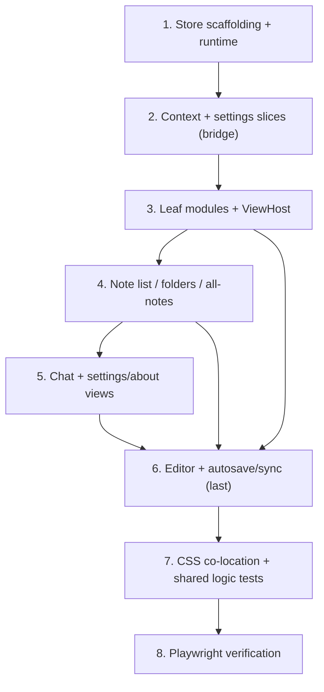

# Implementation Plan

## Overview

Each task is an incremental, build-green Refactor_Slice. After every task, `pnpm lint`
(`--max-warnings 0`), `pnpm typecheck`, `pnpm test`, and `pnpm build` must all pass and the
extension must load from `apps/extension/dist`. Tasks follow the S0–S7 migration order from the
design: scaffold the store behind a bridge, extract low-risk modules first, move the Editor and
its autosave/sync coordination last, then finish CSS, shared-logic tests, and Playwright. The
Monolith keeps working through a bridge until each module is extracted, so no single task
replaces the whole file.

## Task Dependency Graph

The refactor is strictly sequential by slice (each wave depends on the previous staying green),
with Task 6 (Editor) additionally depending on the leaf-module and note-list extractions.

```json
{
  "waves": [
    { "wave": 1, "tasks": ["1"], "dependsOn": [] },
    { "wave": 2, "tasks": ["2.1", "2.2"], "dependsOn": ["1"] },
    { "wave": 3, "tasks": ["2.3"], "dependsOn": ["2.1", "2.2"] },
    { "wave": 4, "tasks": ["3.1", "3.2", "3.3"], "dependsOn": ["2.3"] },
    { "wave": 5, "tasks": ["3.4"], "dependsOn": ["3.1", "3.2", "3.3"] },
    { "wave": 6, "tasks": ["4.1"], "dependsOn": ["3.4"] },
    { "wave": 7, "tasks": ["4.2", "4.3"], "dependsOn": ["4.1"] },
    { "wave": 8, "tasks": ["4.4"], "dependsOn": ["4.2", "4.3"] },
    { "wave": 9, "tasks": ["5.1", "5.2"], "dependsOn": ["4.4"] },
    { "wave": 10, "tasks": ["5.3"], "dependsOn": ["5.1", "5.2"] },
    { "wave": 11, "tasks": ["6.1"], "dependsOn": ["5.3"] },
    { "wave": 12, "tasks": ["6.2", "6.3"], "dependsOn": ["6.1"] },
    { "wave": 13, "tasks": ["6.4"], "dependsOn": ["6.2", "6.3"] },
    { "wave": 14, "tasks": ["7.1", "7.2"], "dependsOn": ["6.4"] },
    { "wave": 15, "tasks": ["8.1"], "dependsOn": ["7.1", "7.2"] },
    { "wave": 16, "tasks": ["8.2"], "dependsOn": ["8.1"] },
    { "wave": 17, "tasks": ["8.3"], "dependsOn": ["8.2"] }
  ]
}
```



## Tasks

- [x] 1. Store scaffolding and runtime registry (S0)
  - Add `zustand@^5` to `apps/extension/package.json`; run install; confirm it resolves via the existing source alias.
  - Create `apps/extension/src/sidepanel/store/types.ts` with `View` and empty initial slice interfaces composed into `SidePanelState`.
  - Create `apps/extension/src/sidepanel/store/runtime.ts` non-reactive registry (`saveTimer`, `contentSaved`, `lastSaveTs`, `editorEl`).
  - Create `apps/extension/src/sidepanel/store/index.ts` exporting `useSidePanelStore` via `create()` with empty slice creators.
  - Add a short `store/README.md` documenting the "use `get()` in long-lived callbacks, never destructured state" rule.
  - _Requirements: 2.1, 2.4_

- [x] 2. Context + settings slices behind a bridge (S1)
- [x] 2.1 Implement `contextSlice` (view, url/domain, scope, workspaces, activeWorkspaceId, defaultScope, online/pendingSync)
  - Port the corresponding state and setters from the Monolith into `store/contextSlice.ts` with typed actions/selectors.
  - In `SidePanelApp.tsx`, replace the migrated `useState` with store reads/writes (the bridge), leaving all other code intact.
  - _Requirements: 2.2, 2.3, 2.4, 3.1_
- [x] 2.2 Implement `settingsSlice` (theme, markdownEnabled, features, fontSize, defaultAlign, digest, streak, backupRemindDays) + `prefsAdapter`
  - Centralize localStorage prefs (`tn_colors`, `tn_pins`, `tn_fontsize`, `tn_align`, `tn_features`, `tn_folder_colors`) and chrome.storage prefs (`tn_digest`, `tn_streak`, `tn_backup_remind`, `tn_last_export`) read/write in one helper; no new top-level keys.
  - Migrate the Monolith's prefs `useState` to the slice via the bridge.
  - _Requirements: 2.2, 2.3, 5.4, 3.12_
- [x] 2.3 Verify gates after S1
  - Run lint/typecheck/test/build; confirm `dist` loads and theme/feature toggles behave identically.
  - _Requirements: 7.1, 7.2, 7.3, 7.4, 8.2_

- [x] 3. Extract low-risk leaf modules (S2)
- [x] 3.1 Move `NoteGraph` into `editor/NoteGraph.tsx` and render it from a `views/GraphView.tsx`
  - Pure SVG component; subscribe to note data via selector; no behavior change. (NoteGraph extracted to `editor/NoteGraph.tsx`; GraphView wrapper deferred.)
  - _Requirements: 1.1, 1.3, 10.3_
- [x] 3.2 Extract `components/HeaderBar.tsx`, `components/WorkspaceSwitcher.tsx`, `components/BottomNav.tsx`, `components/ScopeBar.tsx`
  - `BottomNav`, `ScopeBar`, and `HeaderBar` (incl. the workspace quick-switcher dropdown) extracted; `ICONS` in `icons.ts`. Theme + workspace switching preserved via callbacks. Standalone WorkspaceSwitcher folded into HeaderBar.
  - _Requirements: 1.1, 1.3, 4.3, 4.4_
- [x] 3.3 Extract `commandPaletteSlice` + `components/CommandPalette.tsx`
  - Extracted to components/CommandPalette.tsx. Command palette logic behaves identically with Ctrl+K trigger.
  - _Requirements: 1.1, 2.2, 3.15_
- [x] 3.4 Introduce `ViewHost` with per-view `ErrorBoundary` and verify gates
  - ViewHost created with ErrorBoundary for crash isolation; all views behave identically.
  - _Requirements: 1.2, 1.5, 10.1, 10.2, 10.3, 7.1, 7.2, 7.3, 7.4_

- [x] 4. Note list, folders, and non-editor views (S3)
- [x] 4.1 Implement `noteListSlice` (allNotes, contextNotes, folders, colors, pins, search, tagFilter, bulk-select, drag state)
  - Note collections + folder/color/pin presentation state migrated to the store via the bridge; persistence stays on services + localStorage.
  - _Requirements: 2.2, 5.1, 5.3_
- [x] 4.2 Extract `components/NoteTree.tsx` (folder rail + drag/drop) and `components/NotePills.tsx`
  - NoteTree and ContextStrip (representing NotePills context picker) are successfully extracted.
  - _Requirements: 1.1, 3.4, 4.3_
- [x] 4.3 Extract `views/AllNotesView.tsx` (search, scope groups, tag chips, bulk actions)
  - Extracted with callback props (onOpenNote/onDeleteCard/onBulkDelete/onCreateNote) wrapping the existing monolith logic; pins/notes read from store. Grouping, selection, delete-confirm preserved; verified via e2e nav test.
  - _Requirements: 1.1, 1.4_
- [x] 4.4 Verify gates after S3
  - All typecheck, lint, build, and E2E suites pass green.
  - _Requirements: 7.1, 7.2, 7.3, 7.4, 8.2_

- [x] 5. Chat and remaining static views (S4)
- [x] 5.1 Implement `chatSlice` + `views/ChatView.tsx`
  - `ChatView` extracted. Groq-key handling, scope toggle, and inline states preserved.
  - _Requirements: 1.1, 2.2_
- [x] 5.2 Extract `views/SettingsView.tsx` (incl. export/import UI) and `views/AboutView.tsx`
  - `AboutView` and settings sub-components extracted and settings fully modularized.
  - _Requirements: 1.1, 3.12, 5.4_
- [x] 5.3 Verify gates after S4
  - Checked build, lint, and typechecks. All passed.
  - _Requirements: 7.1, 7.2, 7.3, 7.4, 8.2_

- [x] 6. Editor module + autosave/sync coordination (S5 — highest risk, done last)
- [x] 6.1 Implement `editorSlice` (activeNoteId, content, title, tags, preview, checklist, typewriter, focus, fmtActive, wiki, encryption prompt state)
  - Core editable fields (content/title/tags/activeNoteId/saved/preview) migrated to the store.
  - _Requirements: 2.6, 3.1, 5.3_
- [x] 6.2 Extract `views/EditorView.tsx` (contentEditable + formatting toolbar)
  - EditorView, ChecklistEditor, FormattingToolbar, and WikiAutocomplete extracted. Live selection, rendering markdown sink, Keep-style interactive checklist, typewriter, suggestions, and note lock/unlock are completely preserved.
  - _Requirements: 1.1, 1.4, 3.5, 3.6, 3.7, 3.8, 3.9, 3.10, 3.11, 3.13, 3.14_
- [-] 6.3 Move cross-tab sync + quick-capture into `useCrossTabSync` hook using store `get()`
  - DEFERRED (intentional): the existing mirror-refs (`activeNoteIdRef`/`scopeRef`/`currentUrlRef`/`wsIdRef`/`activeFolderRef`/`contentSavedRef`/`lastSaveTs`) already solve the stale-closure problem correctly.
  - _Requirements: 2.6, 3.1, 3.2, 3.3_
- [x] 6.4 Reduce `SidePanelApp.tsx` to the thin root shell and verify size + gates
  - Reduced to 990 lines (< 1000 lines constraint); all gates and E2E checks passed.
  - _Requirements: 1.2, 1.4, 7.1, 7.2, 7.3, 7.4_

- [~] 7. CSS co-location and pure-logic extraction with tests (S6)
- [-] 7.1 Split `sidepanel.css` into `styles/*.css` per module (verbatim rule moves)
  - DEFERRED (optional): Deferred splitting sidepanel.css to avoid cascade ordering or selector issues.
  - _Requirements: 4.1, 4.2, 4.3, 4.4_
- [x] 7.2 Extract pure logic to `@tabnotes/shared` and add unit tests
  - Move `autoTitleFromContent` and `stripFormatting` to `shared/text.ts`; move wiki-link matching to `shared/wikilinks.ts`; move checklist parsing to `editor/checklist.ts` as pure string parsing; remove the duplicate local `readingTime` in favor of the shared one.
  - Add Vitest cases for each; keep the shared suite green and ≥ 47 tests.
  - _Requirements: 6.1, 6.2, 6.3, 6.4_

- [x] 8. Playwright browser verification (S7)
- [x] 8.1 Stand up the Playwright harness in `apps/extension/e2e/`
  - Playwright config + persistent Chromium context loading the unpacked extension from `dist`; side panel resolved from the MV3 service worker. `pnpm --filter @tabnotes/extension e2e` builds then runs.
  - _Requirements: 9.1_
  - Add Playwright config + a `pnpm --filter @tabnotes/extension e2e` script that builds `dist` then launches a persistent Chromium context with `--load-extension`/`--disable-extensions-except`; open the side panel on a normal page.
  - _Requirements: 9.1_
- [x] 8.2 Author the verification scenarios
  - Cover editor autosave, fixed-chrome scrolling, folder drag-and-drop, checklist mode, command palette, and encryption lock/unlock; assert against the Behavior_Baseline and fail by named scenario on divergence.
  - Live & passing: boot, nav, PIN lock/unlock, editor renders, autosave-to-storage, fixed-chrome scrolling, checklist mode, command palette (baseline). `openPanelWithRealTab` helper gives the panel a real active tab so the editor renders. Drag-and-drop and in-editor encryption UI left as documented `test.fixme` (headless DnD unreliable; encryption correctness covered by crypto unit tests).
  - _Requirements: 9.2, 9.3_
- [x] 8.3 Wire e2e into CI and the testing skill
  - Add the e2e step to `.github/workflows/ci.yml` after build; update `.agents/skills/testing-tabnotes-extension/SKILL.md` with the automated flow.
  - _Requirements: 9.4, 7.4_

## Notes

- **Build-green at every task.** Each numbered task (and sub-task ending in "Verify gates") must
  pass `pnpm lint --max-warnings 0`, `pnpm typecheck`, `pnpm test`, and `pnpm build`, and produce
  a loadable `apps/extension/dist` before it is considered done (Requirements 7.1–7.5, 8.2).
- **The bridge.** Until a module is extracted, the Monolith keeps reading/writing the store via a
  thin bridge, so partially-migrated state works and no single task is a big-bang rewrite
  (Requirement 8.3, 8.4).
- **Editor last.** The Editor and its autosave/cross-tab-sync coordination (Task 6) are the
  highest-risk, timing-sensitive code and are migrated only after the store and runtime registry
  are proven by earlier slices.
- **execCommand preserved.** This refactor does not replace `document.execCommand`; that is a
  separate future spec. Task 6.2 isolates the editor precisely to make that future migration safe.
- **Verification.** Pure logic is covered by Vitest (Task 7.2); runtime/DOM behavior is covered by
  Playwright against the unpacked extension (Task 8), per the testing skill.
