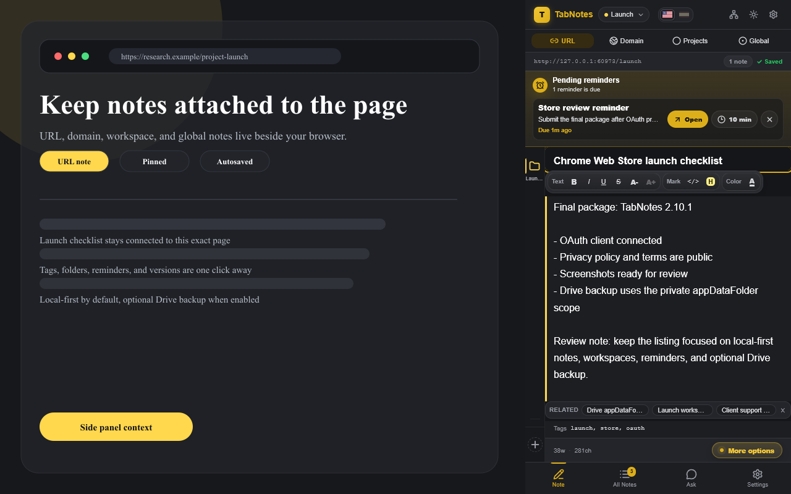
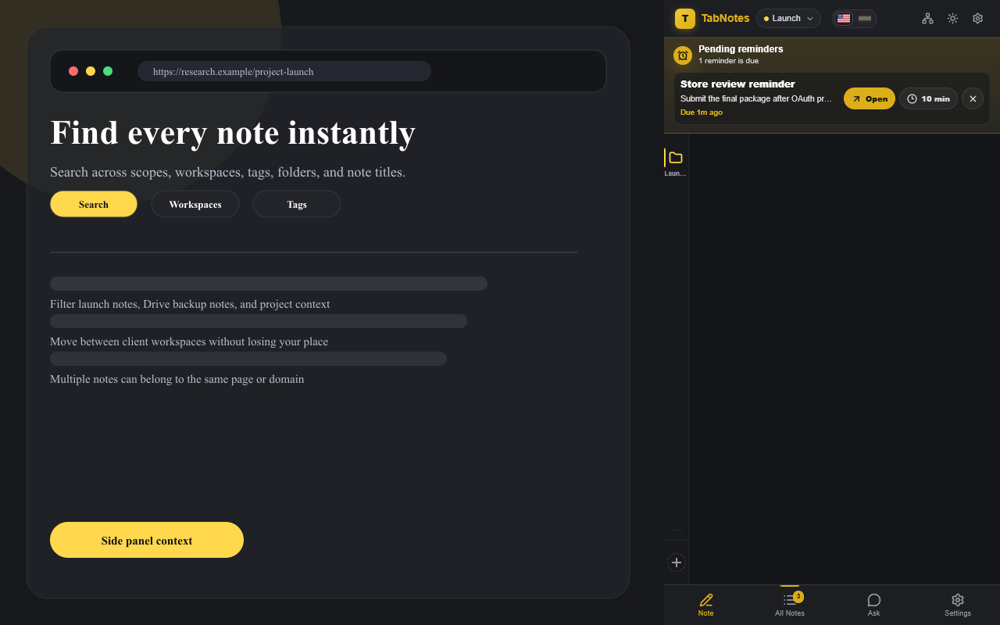
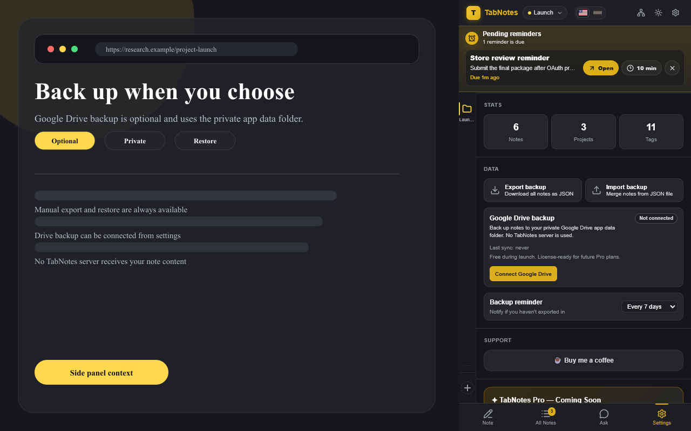
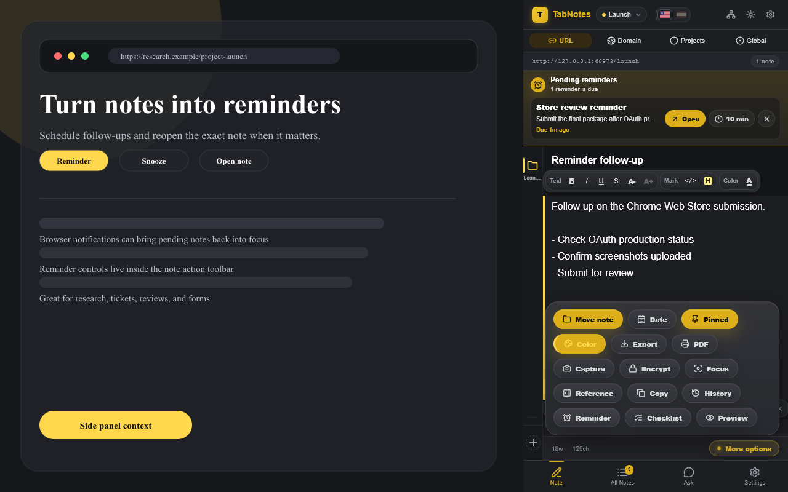
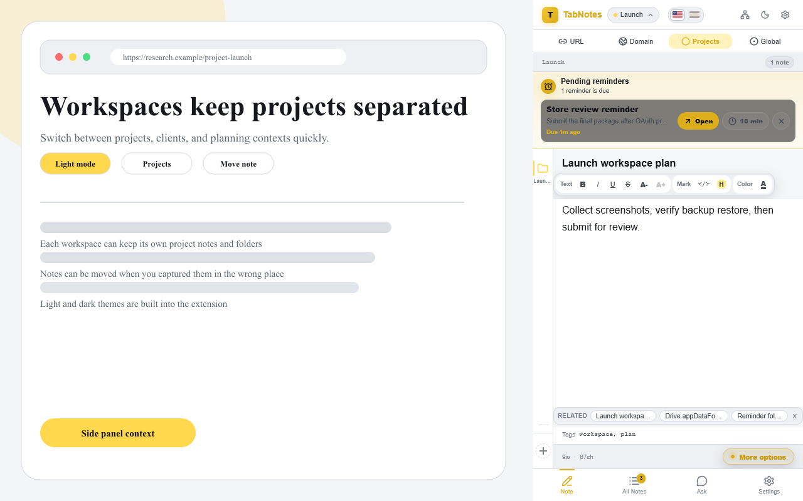

<div align="center">

# TabNotes

**Contextual notes for the page, domain, workspace, or browser context you are working in.**

[](https://chromewebstore.google.com/detail/tabnotes/pniapenkdphjolncppcichbahomfiffj)
[](./tabnotes-extension.zip)
[](apps/extension/public/manifest.json)
[](LICENSE)

**Notes that know where you are.**

[Install from Chrome Web Store](https://chromewebstore.google.com/detail/tabnotes/pniapenkdphjolncppcichbahomfiffj) ·
[Public site](https://tabnotes.atlaspcsupport.com/) ·
[Privacy](https://tabnotes.atlaspcsupport.com/privacy/)

</div>



## Current Release

| Item | Value |
|---|---|
| Public version | `2.10.2` |
| Chrome Web Store ID | `pniapenkdphjolncppcichbahomfiffj` |
| Store package | [`tabnotes-extension.zip`](./tabnotes-extension.zip) |
| Main website | `https://tabnotes.atlaspcsupport.com/` |
| Privacy policy | `https://tabnotes.atlaspcsupport.com/privacy/` |
| Terms | `https://tabnotes.atlaspcsupport.com/terms/` |

## What TabNotes Does

TabNotes is a local-first Chrome extension that keeps notes attached to the browser context where they matter:

- **URL notes** for one exact page.
- **Domain notes** for an entire website or web app.
- **Workspace notes** for projects, clients, tasks, or support workflows.
- **Global notes** for an always-available scratchpad.

The extension runs in Chrome's side panel, autosaves notes locally, supports multiple notes per context, and can optionally back up your data to your private Google Drive app data folder.

## Highlights

| Area | Features |
|---|---|
| Writing | Rich text, Markdown preview, templates, checklist mode, text alignment, colors, note history |
| Organization | Workspaces, folders, tags, pinned notes, note colors, search, note graph |
| Productivity | Command palette, contextual clipping, reminders, daily digest, backup reminders |
| Privacy | Local-first storage, JSON export/restore, optional Drive backup, per-note encryption, PIN lock |
| Internationalization | English and Spanish interface support |

## Screenshots

| Search and notes | Google Drive backup |
|---|---|
|  |  |

| Reminders | Workspaces |
|---|---|
|  |  |

## Privacy Model

TabNotes does not use a TabNotes server for your notes.

- Notes are stored locally in `chrome.storage.local` by default.
- Manual export creates a JSON file controlled by the user.
- Optional Google Drive backup uses only `https://www.googleapis.com/auth/drive.appdata`.
- Drive backup data is written to the user's private Google Drive app data folder.
- The extension does not include advertising, analytics, telemetry, or tracking SDKs.

## Manual Install From ZIP

The recommended install path is the Chrome Web Store. For local testing:

1. Download [`tabnotes-extension.zip`](./tabnotes-extension.zip).
2. Unzip it.
3. Open Chrome and go to `chrome://extensions`.
4. Enable **Developer mode**.
5. Click **Load unpacked**.
6. Select the extracted `dist` folder.

## Development

### Requirements

- Node.js 20+
- pnpm 10+

### Setup

```bash
pnpm install
```

### Build

```bash
pnpm build
pnpm --filter @tabnotes/extension build
```

### Test

```bash
pnpm --filter @tabnotes/extension typecheck
pnpm --filter @tabnotes/extension e2e
```

The extension E2E suite loads the built extension into Chromium and verifies side panel boot, navigation, backup/export/import, editor autosave, reminders, templates, language switching, move note, and layout behavior.

## Repository Structure

```text
apps/
  extension/       Chrome MV3 extension
  tabnotes-site/   Static public site for product, privacy, and terms
  web/             Companion local web app prototype
packages/
  shared/          Storage, backup, crypto, markdown, and utility logic
  i18n/            English and Spanish translations
  ui/              Shared UI primitives
store/             Chrome Web Store listing text and final screenshots
```

## Espanol

TabNotes es una extension de Chrome para tomar notas contextuales segun la pagina, dominio, espacio de trabajo o contexto global del navegador.

- Guarda notas localmente por defecto.
- Permite multiples notas por pagina, dominio o workspace.
- Incluye busqueda, etiquetas, carpetas, plantillas, recordatorios y modo claro/oscuro.
- Puede hacer backup opcional en Google Drive usando la carpeta privada de datos de la app.
- No usa servidor propio para tus notas y no incluye tracking.

Instalacion recomendada:

[Instalar desde Chrome Web Store](https://chromewebstore.google.com/detail/tabnotes/pniapenkdphjolncppcichbahomfiffj)

## License

MIT © TabNotes contributors
